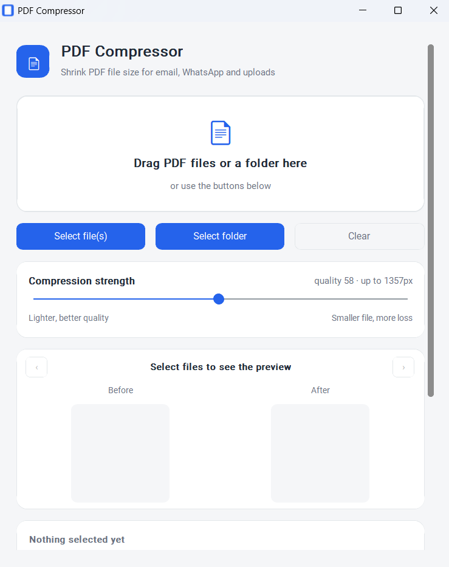
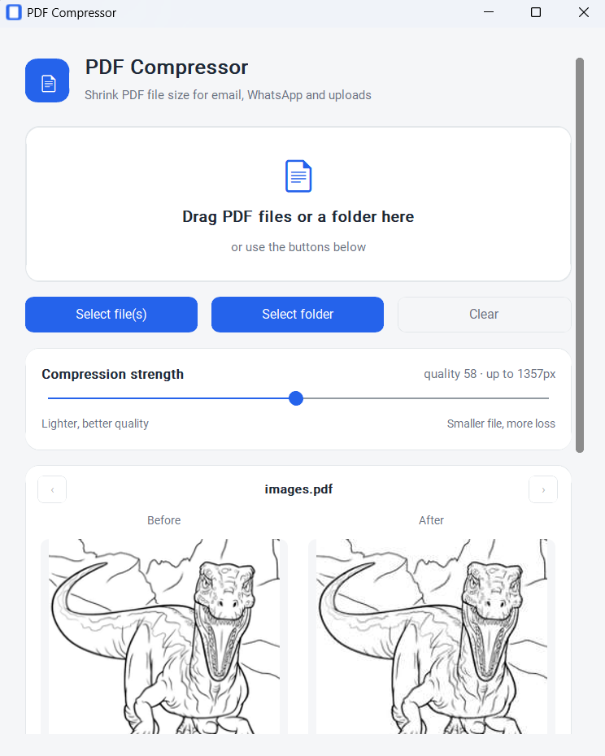

# PDF Compressor

Aplicativo desktop para Windows que reduz drasticamente o tamanho de arquivos PDF, recomprimindo as imagens embutidas neles. Feito principalmente para PDFs escaneados (fotos de documentos, recibos, notas) que costumam vir com fotos em resolução altíssima e acabam pesando dezenas de MB — grandes demais pra mandar por e-mail ou WhatsApp.

[Jump to English version](#pdf-compressor-english)


## Baixar (Windows)

Pegue o instalador pronto na página de **[Releases](../../releases/latest)** — baixe o `PDFCompressor-Setup.exe`, rode e pronto (não precisa de admin, instala só pro seu usuário).

## Como usar

1. Abra o app.
2. Arraste um ou vários PDFs, ou uma pasta inteira, pra área de soltar (ou use os botões "Select file(s)" / "Select folder").
3. Ajuste o **slider de força de compressão** e veja o resultado ao vivo no preview **Before/After** logo abaixo: arrasta o slider e a imagem "After" já muda na hora, sem precisar comprimir nada ainda.
4. Se selecionou mais de um arquivo, use as setas **‹ ›** ao lado do nome pra navegar entre os PDFs e conferir o preview de cada um antes de comprimir.
5. Clique em **Compress**.
6. Os arquivos comprimidos aparecem numa subpasta `compressed/`, criada ao lado de cada PDF original: **os arquivos originais nunca são tocados ou sobrescritos**.

Reduções típicas em PDFs escaneados: **80% a 99%** do tamanho original, mantendo boa legibilidade do texto e das assinaturas. O slider vai de "mais leve, melhor qualidade" até "arquivo menor, mais perda"; o padrão já é um meio-termo razoável, mas cada PDF tem seu próprio ponto ideal, por isso o preview existe.

<p align="center">
  
  
</p>

## Como funciona por dentro

O app é dividido em duas camadas: `core.py` (lógica pura, sem interface) e `app.py` (interface gráfica). Essa separação existe pra que a lógica de compressão possa ser testada ou reaproveitada em outro contexto (ex: um script de linha de comando) sem depender da GUI.

### A lógica de compressão (`core.py`)

Um PDF pesado quase sempre é pesado por causa das **imagens embutidas**, não pelo texto — texto em PDF é só alguns KB. A estratégia é:

1. **Abrir o PDF** com PyMuPDF (`fitz.open`).
2. **Para cada página, listar as imagens embutidas** (`page.get_images(full=True)`) — cada imagem tem um `xref`, o índice dela dentro do arquivo PDF.
3. **Extrair a imagem como pixels** (`fitz.Pixmap(doc, xref)`). Se a imagem estiver em CMYK (4 canais), converte pra RGB primeiro, porque JPEG padrão trabalha em RGB.
4. **Redimensionar com Pillow** se a imagem for maior que 1600px no maior lado (constante `MAX_DIM`). A maioria dos scanners de celular tira fotos em 3000-4000px, muito além do que uma tela ou impressão precisa pra ler um documento — reduzir pra 1600px já elimina boa parte do peso sem perder legibilidade.
5. **Recodificar em JPEG com qualidade 55** (constante `JPEG_QUALITY`), usando `Pillow` com `optimize=True`. JPEG com perdas é o que realmente derruba o tamanho: uma foto sem compressão (bitmap bruto) pode ocupar 10-20x mais que a mesma foto em JPEG qualidade 55, e a olho nu a diferença é quase imperceptível pra texto escaneado.
6. **Substituir a imagem original pela versão comprimida** dentro do próprio PDF, via `page.replace_image(xref, stream=jpg_bytes)` — sem duplicar o objeto no arquivo.
7. **Salvar o PDF** com `garbage=4, deflate=True, clean=True`: `garbage=4` remove objetos órfãos/duplicados que sobram no arquivo, `deflate=True` comprime os streams internos (incluindo o texto), e `clean=True` reescreve a estrutura do PDF de forma mais compacta.

```python
def compress_pdf(src_path, out_path, max_dim=1600, quality=55):
    doc = fitz.open(src_path)
    for page in doc:
        for img in page.get_images(full=True):
            xref = img[0]
            pix = fitz.Pixmap(doc, xref)
            if pix.n - pix.alpha >= 4:          # CMYK -> RGB
                pix = fitz.Pixmap(fitz.csRGB, pix)
            im = Image.frombytes(mode, (pix.width, pix.height), pix.samples)
            if max(im.size) > max_dim:           # downscale
                im = im.resize(new_size, Image.LANCZOS)
            buf = io.BytesIO()
            im.convert("RGB").save(buf, format="JPEG", quality=quality, optimize=True)
            page.replace_image(xref, stream=buf.getvalue())
    doc.save(out_path, garbage=4, deflate=True, clean=True)
```

A segunda função, `collect_pdfs(paths)`, transforma a seleção do usuário (que pode ser um arquivo, vários arquivos, ou uma pasta) numa lista uniforme de tarefas `(arquivo_origem, pasta_destino)`:

- Se for um **arquivo solto**, a pasta de destino é `compressed/` ao lado dele.
- Se for uma **pasta**, faz uma varredura recursiva (`os.walk`) e espelha a mesma estrutura de subpastas dentro de `compressed/`, pulando a própria pasta `compressed/` pra não reprocessar em loop.

### O preview ao vivo (`render_preview` e `simulate_compression`)

O slider não recomprime o PDF inteiro a cada movimento, isso seria lento
demais pra parecer "ao vivo". Em vez disso:

1. `render_preview(pdf_path)` rasteriza só a primeira página do PDF como
   imagem, via `page.get_pixmap()` do PyMuPDF, uma vez, quando você
   seleciona o arquivo ou navega até ele.
2. `simulate_compression(image, max_dim, quality)` aplica o mesmo
   redimensionamento + requantização JPEG que `compress_pdf` faria, mas
   só nessa miniatura já renderizada. Isso roda de novo a cada tick do
   slider, rápido o bastante pra atualizar o lado "After" em tempo real.

O slider em si é um único controle (1 a 100) que mapeia pra dois
parâmetros de uma vez, `max_dim` e `quality` (`app.py:strength_to_params`),
porque na prática ninguém quer ajustar os dois números separadamente,
quer "comprimir mais" ou "comprimir menos".

### A interface (`app.py`)

- **Drag and drop nativo do Windows**, via [`tkinterdnd2`](https://github.com/pmgagne/tkinterdnd2): a janela principal (`ctk.CTk` combinado com `TkinterDnD.DnDWrapper`) registra a área de soltar com `drop_target_register(DND_FILES)` e escuta os eventos `<<Drop>>`, `<<DragEnter>>` e `<<DragLeave>>` pra dar feedback visual (a borda fica azul quando você arrasta um arquivo por cima).
- **Visual**, via [`customtkinter`](https://github.com/TomSchimansky/CustomTkinter), que é uma camada sobre o `tkinter` padrão do Python com widgets modernos (bordas arredondadas, temas claro/escuro).
- **Conteúdo rolável** (`CTkScrollableFrame`): a altura útil da tela varia demais entre PC/monitor/DPI pra um layout de tamanho fixo funcionar em todo lugar. Em vez de forçar uma janela grande o bastante pra caber tudo (que corta os botões numa tela menor), o conteúdo principal fica dentro de um frame rolável, com barra de rolagem aparecendo sozinha quando precisa.
- **Processamento em thread separada** (`threading.Thread`): comprimir vários PDFs pode levar alguns segundos, e rodar isso na thread principal do Tkinter travaria a janela. A UI é atualizada de dentro da thread via `self.log(...)` e `self.progress.set(...)`.
- **Ícone**: usa tanto `iconbitmap` (ícone da janela/barra de título) quanto `iconphoto` (ícone da barra de tarefas), porque em apps `customtkinter`/`tkinter` no Windows o ícone da taskbar às vezes não segue o `.ico` sozinho — é preciso setar também um `PhotoImage`. Também define um `AppUserModelID` próprio via `ctypes.windll.shell32.SetCurrentProcessExplicitAppUserModelID(...)`, pra o Windows não agrupar/confundir o ícone do app com o ícone genérico do `python.exe`.

## Rodando a partir do código-fonte

```bash
git clone https://github.com/caiogadotti/pdf-compressor.git
cd pdf-compressor
python -m venv venv
venv\Scripts\activate      # Windows
pip install -r requirements.txt
python app.py
```

## Gerando o instalador do zero

O projeto é empacotado em duas etapas: **PyInstaller** (transforma o script Python num `.exe` autossuficiente) e **Inno Setup** (embrulha isso num instalador `.exe` com atalhos, desinstalador, etc).

```bash
# 1. Empacotar com PyInstaller
pip install pyinstaller
pyinstaller --noconfirm --windowed --name "PDFCompressor" --icon icon.ico --noupx ^
  --add-data "icon.ico;." --add-data "icon.png;." app.py

# 2. Gerar o instalador com Inno Setup (https://jrsoftware.org/isinfo.php)
ISCC.exe installer.iss
```

O executável final fica em `dist/PDFCompressor/PDFCompressor.exe`, e o instalador em `Output/PDFCompressor-Setup.exe`.

> **Nota sobre tamanho do build:** use sempre um ambiente virtual (`venv`) limpo, só com as dependências do `requirements.txt`, antes de rodar o PyInstaller. Se o Python usado tiver outras bibliotecas pesadas instaladas globalmente (ex: `torch`, `pandas`, `scipy` de outro projeto), o PyInstaller pode incluir elas por engano na análise de dependências, inflando o build de ~80MB pra quase 900MB.

## Stack

| Biblioteca | Função no projeto |
|---|---|
| [PyMuPDF](https://github.com/pymupdf/PyMuPDF) (`fitz`) | Ler, editar e salvar os PDFs; extrair e substituir imagens embutidas |
| [Pillow](https://python-pillow.org/) | Redimensionar e recodificar as imagens em JPEG |
| [CustomTkinter](https://github.com/TomSchimansky/CustomTkinter) | Interface gráfica (sobre o Tkinter padrão) |
| [tkinterdnd2](https://github.com/pmgagne/tkinterdnd2) | Drag and drop nativo de arquivos/pastas do Windows |
| [PyInstaller](https://pyinstaller.org/) | Empacotar o script Python num `.exe` |
| [Inno Setup](https://jrsoftware.org/isinfo.php) | Gerar o instalador Windows |

## Estrutura do projeto

```
pdf-compressor/
├── app.py            # interface gráfica (customtkinter + drag-and-drop)
├── core.py           # lógica de compressão, sem dependência de UI
├── icon.ico / icon.png
├── installer.iss     # script do Inno Setup
├── requirements.txt
└── LICENSE
```

## Licença

MIT — veja [LICENSE](LICENSE).

---

# PDF Compressor (English)

A Windows desktop app that drastically shrinks PDF file size by recompressing the images embedded inside them. Built mainly for scanned PDFs (photographed documents, receipts, invoices) that often come with extremely high-resolution photos and end up weighing tens of MB — too heavy to email or send over WhatsApp.

## Download (Windows)

Grab the ready-to-run installer from the **[Releases](../../releases/latest)** page — download `PDFCompressor-Setup.exe`, run it, done (no admin rights needed, installs per-user).

## How to use

1. Open the app.
2. Drag one or more PDFs, or an entire folder, onto the drop area (or use the "Select file(s)" / "Select folder" buttons).
3. Adjust the **compression strength slider** and watch the **Before/After** preview update live right below it, drag the slider and the "After" image changes instantly, no compression happens yet.
4. If you selected more than one file, use the **‹ ›** arrows next to the filename to step through the PDFs and check each one's preview before compressing.
5. Click **Compress**.
6. Compressed files show up in a `compressed/` subfolder created next to each original PDF: **original files are never touched or overwritten**.

Typical reduction on scanned PDFs: **80% to 99%** of the original size, while keeping text and signatures readable. The slider goes from "lighter, better quality" to "smaller file, more loss"; the default is already a reasonable middle ground, but every PDF has its own sweet spot, that's what the preview is for.

<p align="center">
  
  
</p>

## How it works internally

The app is split into two layers: `core.py` (pure logic, no UI) and `app.py` (the GUI). This separation means the compression logic can be tested or reused elsewhere (e.g. a CLI script) without depending on the GUI.

### The compression logic (`core.py`)

A heavy PDF is almost always heavy because of its **embedded images**, not its text — text in a PDF is just a few KB. The strategy is:

1. **Open the PDF** with PyMuPDF (`fitz.open`).
2. **List the embedded images on each page** (`page.get_images(full=True)`) — each image has an `xref`, its index inside the PDF file.
3. **Extract the image as pixel data** (`fitz.Pixmap(doc, xref)`). If the image is CMYK (4 channels), convert it to RGB first, since standard JPEG works in RGB.
4. **Resize with Pillow** if the image is larger than 1600px on its longest side (the `MAX_DIM` constant). Most phone scanner apps shoot at 3000-4000px, far beyond what's needed to read a document on screen or print — downscaling to 1600px removes most of the weight without hurting readability.
5. **Re-encode as JPEG at quality 55** (`JPEG_QUALITY`), using Pillow with `optimize=True`. Lossy JPEG is what actually crushes the size: an uncompressed photo can be 10-20x heavier than the same photo at JPEG quality 55, and the difference is barely noticeable for scanned text.
6. **Swap the original image for the compressed one** inside the same PDF via `page.replace_image(xref, stream=jpg_bytes)` — without duplicating the object in the file.
7. **Save the PDF** with `garbage=4, deflate=True, clean=True`: `garbage=4` strips orphaned/duplicate objects left over in the file, `deflate=True` compresses internal streams (including text), and `clean=True` rewrites the PDF structure more compactly.

The second function, `collect_pdfs(paths)`, turns the user's selection (a single file, several files, or a folder) into a uniform list of `(source_file, output_folder)` jobs — mirroring the folder structure into a `compressed/` subfolder when a whole directory is dropped.

### The live preview (`render_preview` and `simulate_compression`)

The slider doesn't recompress the whole PDF on every move, that would be
too slow to feel live. Instead:

1. `render_preview(pdf_path)` rasterizes just the PDF's first page as an
   image, via PyMuPDF's `page.get_pixmap()`, once, when you select the
   file or navigate to it.
2. `simulate_compression(image, max_dim, quality)` applies the same
   resize + JPEG requantization `compress_pdf` would, but only on that
   already-rendered thumbnail. This runs again on every slider tick,
   fast enough to update the "After" side in real time.

The slider itself is a single control (1 to 100) that maps to two
parameters at once, `max_dim` and `quality` (`app.py:strength_to_params`),
because in practice nobody wants to tune those two numbers separately,
they want "compress more" or "compress less".

### The UI (`app.py`)

- **Native Windows drag and drop** via [`tkinterdnd2`](https://github.com/pmgagne/tkinterdnd2): the main window (`ctk.CTk` combined with `TkinterDnD.DnDWrapper`) registers the drop area with `drop_target_register(DND_FILES)` and listens for `<<Drop>>`, `<<DragEnter>>` and `<<DragLeave>>` events for visual feedback.
- **Look and feel** via [`customtkinter`](https://github.com/TomSchimansky/CustomTkinter), a modern-widget layer on top of Python's standard `tkinter`.
- **Scrollable content** (`CTkScrollableFrame`): usable screen height varies too much across PCs/monitors/DPI for a fixed-size layout to work everywhere. Instead of forcing a window tall enough to fit everything (which cuts off the buttons on a smaller screen), the main content sits inside a scrollable frame, with a scrollbar showing up on its own whenever it's needed.
- **Background thread processing** (`threading.Thread`): compressing several PDFs can take a few seconds, and doing that on Tkinter's main thread would freeze the window. The UI is updated from the worker thread via `self.log(...)` and `self.progress.set(...)`.
- **Icon**: uses both `iconbitmap` (title bar/window icon) and `iconphoto` (taskbar icon), because on Windows, `customtkinter`/`tkinter` apps don't always pick up the `.ico` for the taskbar automatically — a `PhotoImage` needs to be set too. It also sets a dedicated `AppUserModelID` via `ctypes.windll.shell32.SetCurrentProcessExplicitAppUserModelID(...)` so Windows doesn't group/confuse the app's icon with the generic `python.exe` icon.

## Running from source

```bash
git clone https://github.com/caiogadotti/pdf-compressor.git
cd pdf-compressor
python -m venv venv
venv\Scripts\activate      # Windows
pip install -r requirements.txt
python app.py
```

## Building the installer from scratch

The project is packaged in two steps: **PyInstaller** (turns the Python script into a self-contained `.exe`) and **Inno Setup** (wraps that into a Windows installer with shortcuts, an uninstaller, etc).

```bash
# 1. Package with PyInstaller
pip install pyinstaller
pyinstaller --noconfirm --windowed --name "PDFCompressor" --icon icon.ico --noupx ^
  --add-data "icon.ico;." --add-data "icon.png;." app.py

# 2. Build the installer with Inno Setup (https://jrsoftware.org/isinfo.php)
ISCC.exe installer.iss
```

The final executable lands at `dist/PDFCompressor/PDFCompressor.exe`, and the installer at `Output/PDFCompressor-Setup.exe`.

> **Note on build size:** always use a clean virtual environment (`venv`) with only the packages from `requirements.txt` before running PyInstaller. If the Python you use has other heavy libraries installed globally (e.g. `torch`, `pandas`, `scipy` from another project), PyInstaller's dependency analysis may mistakenly bundle them, inflating the build from ~80MB to nearly 900MB.

## Stack

| Library | Role in the project |
|---|---|
| [PyMuPDF](https://github.com/pymupdf/PyMuPDF) (`fitz`) | Read, edit and save PDFs; extract and replace embedded images |
| [Pillow](https://python-pillow.org/) | Resize and re-encode images as JPEG |
| [CustomTkinter](https://github.com/TomSchimansky/CustomTkinter) | GUI (on top of standard Tkinter) |
| [tkinterdnd2](https://github.com/pmgagne/tkinterdnd2) | Native Windows drag and drop for files/folders |
| [PyInstaller](https://pyinstaller.org/) | Package the Python script into a `.exe` |
| [Inno Setup](https://jrsoftware.org/isinfo.php) | Build the Windows installer |

## Project structure

```
pdf-compressor/
├── app.py            # GUI (customtkinter + drag-and-drop)
├── core.py           # compression logic, no UI dependency
├── icon.ico / icon.png
├── installer.iss     # Inno Setup script
├── requirements.txt
└── LICENSE
```

## License

MIT — see [LICENSE](LICENSE).
